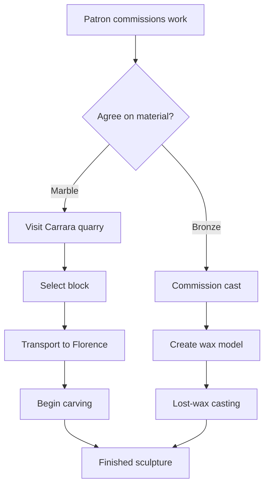
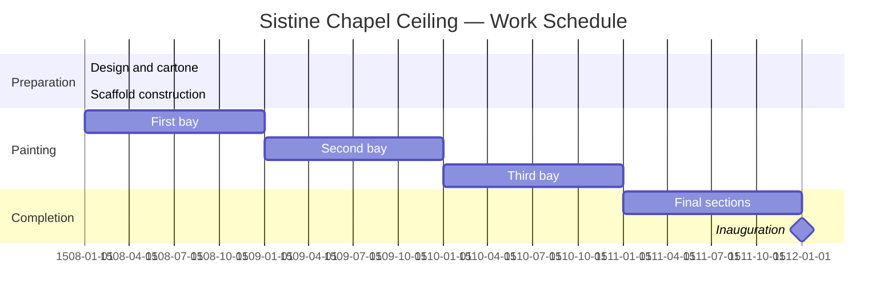

-----

## title: “Michelangelo on Markdown! Ep.5: The Last Judgement”
published: false
description: “Episode 5: The Last Judgement is Michelangelo’s most complex composition — over 300 figures, organised through dynamic scripting of position, weight, and gesture. Quarkdown’s scripting system works at the same scale: variables, conditionals, loops, let expressions, data from CSV, XY charts, and Mermaid diagrams. Turing-complete documents.”
tags: [quarkdown, markdown, scripting, data]
cover_image: “https://raw.githubusercontent.com/vanHeemstraPublications/dev-to/main/images/michelangelo-markdown-episode-05.png”
series: “Michelangelo on Markdown Series”
canonical_url: “”
organization: “the-software-s-journey”
part: 1

# Michelangelo on Markdown! ✍️

## Episode 5: The Last Judgement

> *“The greatest artist does not have any concept which a single piece of marble does not itself contain within its excess.”*
> — Michelangelo Buonarroti

-----

## Three Hundred Figures, One Logic 🎨

The Last Judgement on the altar wall of the Sistine Chapel contains over three hundred individual figures. They are not placed at random. Each position encodes a logic: the saved rise on the left, the damned fall on the right, Christ at the centre commands both movements. The angels at the top sound the trumpets of resurrection. The river Styx flows across the bottom. The whole composition follows a dynamic, programmable logic.

Quarkdown is Turing complete. It can compute, remember, loop, branch, and transform data. The same document source file that holds prose also holds the logic that generates tables from CSV data, computes statistics, conditionally renders content, and loops over data structures to produce repeating elements. The document is not a static manuscript — it is an executable composition.

-----

## 🗂️ SIPOC — The Last Judgement

|**Suppliers**         |**Inputs**                                            |**Process**                                                |**Outputs**                                                           |**Customers**                                                |
|----------------------|------------------------------------------------------|-----------------------------------------------------------|----------------------------------------------------------------------|-------------------------------------------------------------|
|Author (scriptwriter) |Variables, conditions, loops, let expressions, lambdas|Quarkdown evaluates the scripting layer at compile time    |Dynamic content: computed text, conditional sections, generated tables|Document readers who see the result — never the logic        |
|External CSV data file|`data.csv` with rows and columns                      |`.filetext {data.csv}::csv::table` or explicit manipulation|A rendered table directly from the CSV source                         |Technical and scientific documents requiring live data tables|
|Chart specification   |XY data points or Mermaid diagram definition          |Quarkdown renders charts using built-in XY chart or Mermaid|Visual charts embedded in the document                                |Data analysis reports, presentations, technical documentation|

-----

## Variables and Dynamic Content: Naming the Figures 📝

From Episode 3, we know `.var` declares a variable. Variables make documents maintainable and consistent:

```quarkdown
.var {year} {2026}
.var {institution} {Accademia di Belle Arti}
.var {project_title} {Renaissance Proportional Systems}

This report was prepared for the .institution in .year
as part of the .project_title research programme.
```

Change `.var {year} {2027}` once at the top of the file and every occurrence updates.

### Updating variables

Variables are mutable. Call the variable name with a new value to update it:

```quarkdown
.var {chapter_count} {0}

.chapter_count {1}
Chapter .chapter_count: Introduction

.chapter_count {2}
Chapter .chapter_count: Methodology

.chapter_count {3}
Chapter .chapter_count: Results
```

-----

## Let Expressions: Temporary Bindings ⚗️

`.let` binds a value within a scoped block — the binding expires when the block ends:

```quarkdown
.let {base} {12}
    .let {height} {7}
        The area of this triangle is .multiply {.base} by:{.height}::divide {2} by:{} cm².
```

Let expressions prevent namespace pollution in complex documents. Use them for intermediate computations that should not persist.

-----

## Math Operations: The Counting Room 🔢

Quarkdown’s arithmetic functions work inline:

```quarkdown
Golden ratio: .divide {.add {1} and:{.sqrt {5}}} by:{2}

Area: .multiply {3.14159} by:{.pow {r} to:{2}}

Pages remaining: .subtract {.pagecount} from:{.pagecounter}
```

Combine with variables for maintainable computations:

```quarkdown
.var {width}  {15}
.var {height} {22}
.var {margin} {2.5}

Page area: .multiply {.width} by:{.height} cm²
Print area: .multiply {.subtract {.width} from:{.multiply {.margin} by:{2}}}
            by:{.subtract {.height} from:{.multiply {.margin} by:{2}}} cm²
```

-----

## Conditionals: The Branching Composition 🔀

Conditional statements allow sections to appear only when certain conditions are met:

```quarkdown
.var {draft} {true}

.if {.draft}
    .box {Draft Notice} type:{warning}
        This document is a draft and has not been reviewed.
        Last edited: .var {edit_date} {30 April 2026}

.ifnot {.draft}
    .box {Published} type:{tip}
        This document has been reviewed and approved.
```

### Conditional with else

```quarkdown
.var {include_appendix} {true}

.if {.include_appendix}
    ## Appendix A: Raw Data

    The full dataset is included below.

.else
    *Appendix A is available from the corresponding author on request.*
```

### Comparison conditions

```quarkdown
.var {figure_count} {12}

.if {.gte {.figure_count} and:{10}}
    A List of Figures appears on page .pagecount.

    .listoffigures
```

-----

## Loops: The Serpentine Figure Sequence 🌀

Loops allow Quarkdown to generate repeated content from data structures:

### Iterating over a range

```quarkdown
.foreach {.range {1} to:{8}}
    n:
    **Chapter .n** begins on the next page.
    .pagebreak
```

### Iterating over a list

```quarkdown
.var {sculptors}
    - Michelangelo Buonarroti
    - Donatello di Niccolò
    - Lorenzo Ghiberti
    - Andrea del Verrocchio

.foreach {.sculptors}
    sculptor:
    - **.sculptor**
```

### Map: Transforming a sequence

```quarkdown
.range {1} to:{10}::map
    lambda: n:
    .pow {.n} to:{2}
```

Produces the sequence of squared numbers: 1, 4, 9, 16, 25, 36, 49, 64, 81, 100.

### A function that uses a loop

```quarkdown
.function {gallery_row}
    images count:
    .row
        .foreach {.range {1} to:{.count}}
            i:
            !(100%)[Image .i](.images/.i.jpg)
```

-----

## Destructuring: Naming the Parts of a Whole 🧩

Destructuring allows pulling individual values out of lists and ranges:

```quarkdown
.var {dimensions} {15 22}

.let {(width height)} {.dimensions}
    Width: .width cm, Height: .height cm
    Aspect ratio: .divide {.width} by:{.height}
```

-----

## Data from Files: The Scriptorium’s Records 📋

### Reading text from a file

```quarkdown
.filetext {notes/introduction.md}
```

This reads the entire contents of the file and includes them inline — identical to `.include` but for arbitrary file content.

### Tables from CSV data

```quarkdown
.filetext {data/marble_types.csv}::csv::table
```

Given `marble_types.csv`:

```
Type,Origin,Compressive Strength (MPa),Primary Use
Carrara white,Tuscany,150,Sculpture, architecture
Carrara grey,Tuscany,148,Architecture
Pentelic,Greece,165,Classical sculpture
Parian,Greece,170,High-precision sculpture
```

The chain reads the CSV, parses it, and renders a fully formatted table with header row and data rows. No markup required.

### Table manipulation

```quarkdown
.filetext {data/sales.csv}::csv
    data:
    .table
        data: .data::filter
            row:
            .gte {.row.revenue} and:{10000}
```

This filters the CSV rows where revenue ≥ 10000 before rendering the table — computed filtering at compile time.

-----

## XY Charts: The Graph of the Commission 📈

```quarkdown
.xychart
    x: years
    y: commissions
    data:
        - year: 1490, value: 2
        - year: 1495, value: 5
        - year: 1500, value: 8
        - year: 1505, value: 12
        - year: 1510, value: 7
        - year: 1515, value: 9
    type: line
    title: Michelangelo's Commissions by Decade
```

Available chart types: `line`, `bar`, `area`, `scatter`.

-----

## Mermaid Diagrams: The Architectural Blueprint 🏛️

Quarkdown integrates Mermaid for diagrammatic content — flowcharts, sequence diagrams, Gantt charts, and more:

```quarkdown

```

```quarkdown

```

-----

## A Complete Data-Driven Example: Commission Analysis 📊

```quarkdown
.doctype {paged}
.var {analysis_year} {1510}
.var {patron_threshold} {3}

## Commission Summary: Florence, .analysis_year

.box {Data Source} type:{note}
    All commission records sourced from the Medici Archive, Florence.
    Data includes commissions valued above 50 florins.

### Sculptor Activity

.filetext {data/commissions_1510.csv}::csv::table

### Trend Analysis

Sculptors with more than .patron_threshold major commissions in .analysis_year:

.var {commissions}
    - name: Michelangelo, count: 7
    - name: Donatello, count: 2
    - name: Ghiberti, count: 4

.foreach {.commissions}
    sculptor:
    .if {.gte {.sculptor.count} and:{.patron_threshold}}
        - **.sculptor.name**: .sculptor.count commissions

### Year-by-Year Growth

.xychart
    type: bar
    title: Total Commission Value (florins), 1505–.analysis_year
    data:
        - year: 1505, value: 1240
        - year: 1506, value: 1580
        - year: 1507, value: 1320
        - year: 1508, value: 2100
        - year: 1509, value: 1890
        - year: 1510, value: 2640
```

-----

In **Episode 6**, we study Michelangelo’s greatest architectural commission — St. Peter’s Basilica. Multi-file Quarkdown projects, the `.include` and subdocument system, the built-in Paper and Docs libraries, and cross-references.

-----

**🔗 Resources**

- **Variables**: [quarkdown.com/wiki/variables](https://quarkdown.com/wiki/variables)
- **Conditional statements**: [quarkdown.com/wiki/conditional-statements](https://quarkdown.com/wiki/conditional-statements)
- **Loops**: [quarkdown.com/wiki/loops](https://quarkdown.com/wiki/loops)
- **Table from CSV**: [quarkdown.com/wiki/file-data](https://quarkdown.com/wiki/file-data)
- **XY chart**: [quarkdown.com/wiki/xy-chart](https://quarkdown.com/wiki/xy-chart)
- **Mermaid diagrams**: [quarkdown.com/wiki/mermaid-diagrams](https://quarkdown.com/wiki/mermaid-diagrams)

-----

*✍️ Michelangelo on Markdown Series — crafting beautiful documents with Quarkdown and Tolaria, through the lens of the Renaissance master’s studio.*
